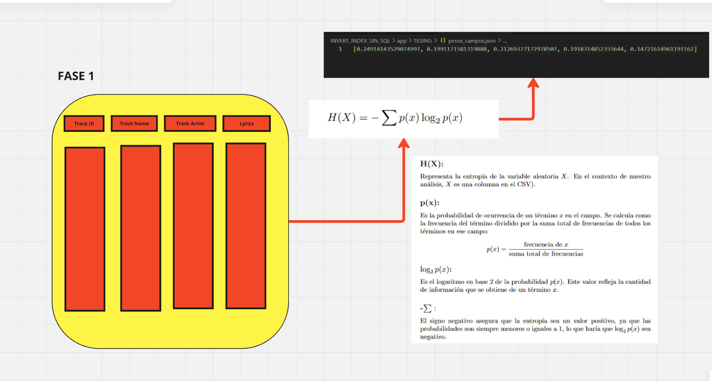
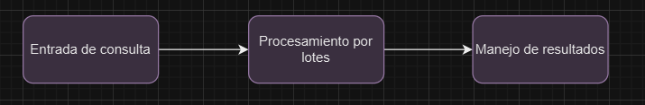
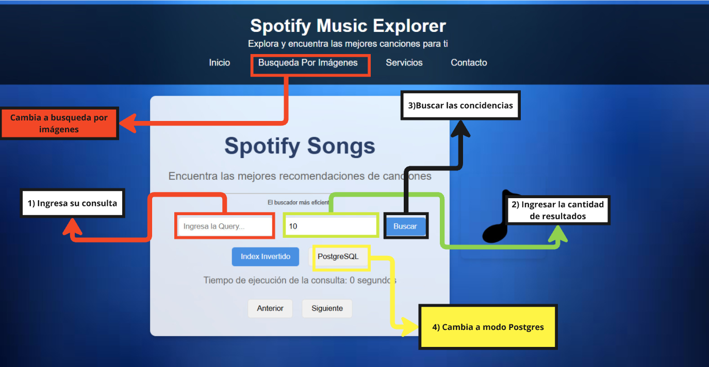
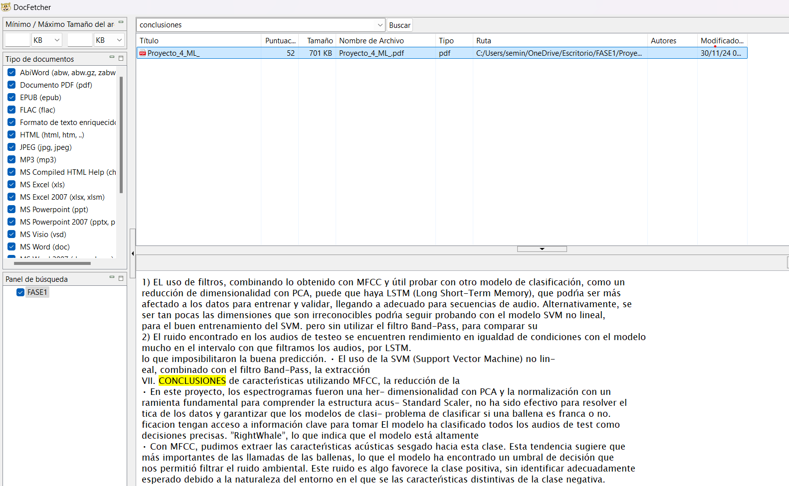

# Proyecto: Búsqueda y Recuperación de la Información

### Descripción
Este proyecto es una aplicación web que permite realizar búsquedas avanzadas en una base de datos de canciones de Spotify, mostrando información relevante como ID, nombre, artista, popularidad y álbum. Combina un backend en Python con Flask y PostgreSQL con un frontend desarrollado en HTML, CSS y JavaScript.

---

## Características principales
- Búsqueda optimizada utilizando índice invertido
- Visualización de resultados con campos clave:
  - `Track ID`
  - `Track Name`
  - `Track Artist`
  - `Track Popularity`
  - `Track Album Name`
- Selección dinámica entre dos tablas con diferentes estructuras (`Indice invertido` y `Indice Postgresql`).
- Interfaz de usuario amigable con resultados interactivos.
- Medición y visualización del tiempo de consulta.

---

## Tecnologías utilizadas
### Backend
- **Python 3.10** 
- **Flask**: Framework para construir el servidor y manejar las rutas.
- **PostgreSQL**: Base de datos relacional para almacenar información musical.
- **psycopg2**: Librería para conectar Python con PostgreSQL.

### Frontend
- **HTML/CSS/JavaScript**: Construcción de la interfaz.
- **Fetch API**: Manejo de solicitudes HTTP para conectar el frontend con el backend.

---

## Estructura del Proyecto
```plaintext
📁 Proyecto
│
├── 📂 backend
│   ├── app.py                 # Archivo principal de Flask
│   ├── consulta_db.py         # Lógica de consultas a PostgreSQL
│   └── requirements.txt       # Dependencias del proyecto
│
├── 📂 frontend
│   ├── index.html             # Interfaz de usuario
│   ├── styles.css             # Estilos personalizados
│   └── script.js              # Lógica de interacción con el usuario
│
└── README.md                  # Documentación del proyecto
```

# Organización del equipo

| Participante      | Papel |
|-------------------|-------|
| Aldair Seminario | Creación de índice invertido, Implementación de SPIMI para busqueda textual y diseño de frontend|
| Nicol Campoverde | Adaptación del frontend con el backend y implementación de busqueda por imágenes                |
| OMAR             | Procesamiento de archivos csv y además  del desarrollo de la base de datos en postgres          |


# Introducción
- [Objetivo del proyecto](#Datos)
- [Descripción del dominio de datos y la importancia de aplicar
indexación.](#librerías-utilizadas)


## Backend
- [Construcción del índice invertido](#construcción-del-índice-invertido)
- [Construcción del indice Multimedia](#manejo-de-memoria-secundaria)
- [Manejo de memoria secundaria](#ejecución-óptima-de-consultas)

## Análisis de Tamaño de Buffert
- [Análisis sobre los Bufferts ](#análisis-de-la-maldición-de-la-dimensionalidad-y-cómo-mitigarlo)

## Frontend
- [Diseño del índice con PostgreSQL](#diseño-del-índice-con-postgresql)
- [Análisis comparativo con su propia implementación](#análisis-comparativo-con-su-propia-implementación)
- [Screenshots de la GUI](#screenshots-de-la-gui)

## Experimentación
- [Resultados de la query](#resultados-de-la-query)
- [Análisis y discusión](#análisis-y-discusión)

<!-- Secciones -->

## 1] Objetivo del proyecto
Este proyecto tiene como objetivo diseñar e implementar un sistema de búsqueda y recuperación de datos, ya sean datos multimedia o textuales. 
Se utilizan estructuras de datos vistas en el curso de Bases de Datos 2, tales como:

- Índice invertido
- Similitud del coseno
- Búsqueda por rango

Además, se busca que la experiencia del usuario en la interfaz gráfica sea lo más amigable y 
entendible posible para facilitar el manejo de nuestro producto.


## 2] Descripción del dominio de datos y la importancia de aplicar indexación.
  ### 2.1] Búsquedas Textuales
  
  ####  2.1.1] Tipo de Datos
  
  El sistema almacena principalmente **datos textuales** en forma de registros de canciones , los cuales contienen  **18,455**. Esto incluye:
  - **Texto**: Letras de las canciones, nombres de las pistas y artistas.
  - **Metadatos**: Información adicional relacionada con cada canción, como el álbum al que pertenecen.
  
  #### 2.1.2]  Estructura de los Datos
  Los datos están organizados en un archivo **CSV**, para almacenar datos tabulares. 
  Cada fila del archivo representa un registro de una canción, y las columnas contienen los diferentes atributos de cada registro. 
  Las columnas  que usaremos para la impleentación  son:
  
  - **Track ID**: Identificador único de la canción.
  - **Track Name**: Nombre de la canción.
  - **Track Artist**: Artista de la canción.
  - **Lyrics**: Letra de la canción.
  
  #### 2.1.3] Origen de los Datos
  
  Los datos provienen de **https://www.kaggle.com/datasets/imuhammad/audio-features-and-lyrics-of-spotify-songs/data**, específicamente de un dataset disponible públicamente que contiene información sobre canciones en Spotify.
  Este dataset ha sido recopilado y estructurado para facilitar su uso en el proyecto.
    
  En este proyecto, las relaciones entre los datos son simples, ya que cada canción se identifica de manera única a través de su **Track ID**.   
  
El propósito de los datos en este sistema incluye:

- **Análisis Estadístico**: Realizar análisis para calcular la similitud del coseno, el TF-IDF  y

aplicar técnicas de normalización para mejorar la precisión en la recuperación de información.

- **Búsqueda**: Utilizar los datos como fuente para permitir a los usuarios realizar búsquedas efectivas en nuestro simulador,
 facilitando la localización de canciones y letras de manera  más rápida.

- **Experiencia de Usuario**: Desarrollar un sistema basado en el contenido de los datos que permita a los usuarios realizar búsquedas de canciones en función de sus consultas,
asegurando que los resultados sean lo más cercanos posible a lo que realmente buscan.


### 2.2] Búsquedas Multidimencional:

En cuanto a las búsquedas por imágenes, debido a la falta de un dataset completo que 
contenga tanto imágenes como descripciones, decidimos trabajar con un dataset separado.
Este dataset contiene 44,000 fotos de productos comunes que se encuentran en una tienda.
Estas imágenes serán utilizadas en el proyecto para realizar las búsquedas visuales.


#### 2.2.1) Estructura de los Datos

En este proyecto, estamos utilizando únicamente dos elementos del dataset:

- **File Name**: El nombre del archivo de la imagen, que nos permite identificar cada producto.
- **URL**: La dirección donde se encuentra alojada cada imagen, facilitando su acceso y visualización.

Los datos que estamos utilizando se pueden encontrar en el siguiente enlace: [Fashion Product Images Dataset](https://www.kaggle.com/datasets/paramaggarwal/fashion-product-images-dataset/data).

####  2.2.2) Propósito de los Datos
El propósito de los datos en este sistema incluye:

- **Análisis de Imágenes**: Implementar técnicas de análisis de imágenes para extraer características relevantes que permitan mejorar
la precisión en las búsquedas visuales.

- **Búsqueda Visual**: Utilizar las imágenes como fuente para permitir a los usuarios realizar búsquedas de productos basadas en consultas visuales,
facilitando la localización de productos de manera intuitiva y eficiente.

- **Experiencia de Usuario**: Desarrollar un sistema que permita a los usuarios buscar productos mediante la carga de imágenes, asegurando que los resultados
sean lo más cercanos posible a lo que realmente buscan, mejorando así la interacción con la plataforma.

### 2.3]  importancia de aplicar indexación:

La **indexación** es crucial para mejorar la eficiencia de las búsquedas. Al indexar las imágenes, podemos reducir significativamente el tiempo de respuesta al permitir que el sistema localice rápidamente 
los productos relevantes en función de las consultas visuales. Esto optimiza la experiencia del usuario, asegurando resultados más rápidos y precisos.

Además, la indexación también es fundamental para las búsquedas textuales. Al indexar descripciones y atributos de los productos, el sistema puede procesar consultas de texto de manera más eficiente, 
proporcionando resultados relevantes en función de las palabras clave ingresadas por el usuario. Esto permite una búsqueda más completa y efectiva, combinando tanto la búsqueda visual como la textual para mejorar la
experiencia general del usuario.


## 3] Backend: Índice Invertido

  ###  3.1] Construcción del índice invertido en memoria secundaria

  #### 1] Primero se calcula los pesos de cada una de las columnas


   
   

  
  ###  3.2] Ejecución óptima de consultas aplicando Similitud de Coseno
  
  ###  3.3] Explique cómo se construye el índice invertido en
  PostgreSQL/MongoDB

## 4] Backend : Índice Multidimensional 

## Técnica de indexación  Indice Multidimencional
La indexación eficiente para las colecciones de imágenes y mucho más si tienen una mucha cantidad de información es un desafío en el campo de la recuperación visual. Para abordar este problema se propone esta técnica de indexación multidimensional que permita realizar búsquedas de manera rápida y precisa.

Este enfoque se basa en la extracción de características, seguido de la construcción de una estructura de indexación espacial. De esta manera, los usuarios pueden buscar imágenes similares a partir de una imagen de referencia.

### Extracción de características:  

- Utilizamos el modelo Inception V3 pre-entrenado en ImageNet para extraer las características de las imágenes.
```python
modelo = InceptionV3(weights='imagenet', include_top=False, pooling='avg')
````
```


                                                    +-----------------------+
                                                    |  Ingreso de la URL    |
                                                    |  (Imagen)             |
                                                    +-----------------------+
                                                               |
                                                               v
                                                    +-----------------------+
                                                    |  Cargar la imagen     |
                                                    |  desde la URL         |
                                                    +-----------------------+
                                                               |
                                                               v
                                                    +-----------------------+
                                                    |  Preprocesar imagen   |
                                                    |  (Redimensionar,      |
                                                    |  normalización)       |
                                                    +-----------------------+
                                                               |
                                                               v
                                                    +-----------------------+
                                                    |  Pasar imagen por     |
                                                    |  el modelo InceptionV3|
                                                    |  (Extracción de      |
                                                    |  características)     |
                                                    +-----------------------+
                                                               |
                                                               v
                                                    +-----------------------+
                                                    |  Obtener el vector    |
                                                    |  de características   |
                                                    +-----------------------+
                                                               |
                                                               v
                                                    +-----------------------+
                                                    |  Almacenar el vector  |
                                                    |  en archivo binario   |
                                                    +-----------------------+
                                                               |
                                                               v
                                                    +-----------------------+
                                                    |  Fin del proceso      |
                                                    +-----------------------+

````
### Sistema de almacenamiento
  + Estructura de Archivos

  ```plaintex
  📁 
  │
  |---output.bin: Vectores de características
  |---positiondata_file: Mapeo de posiciones
  |---output.bin: Vectores de características
  |---id_to_pos_file: Diccionario de IDs a posiciones

  ````
  + Formato de Datos
    
    Se está usando el módulo `struct` de Python para almacenar datos en formato binario
    
  ```python
  data = struct.pack('i' + 'f' * len(img_encoding), id, *img_encoding)
  position_data.write(struct.pack('i', position_seek))
  ```

  + Recuperación de datos
    
    Se Recupera el vector de características de una imagen que ha sido almacenada en un archivo binario, a partir de una posición dada.
    ```python
    data_bin = data_file.read(INTEGER_BYTES + EXPECTED_LENGTH_DATA * FLOAT_BYTES)
    return struct.unpack('i' + 'f'*EXPECTED_LENGTH_DATA, data_bin)[1:]
    ```
  

## Como se realiza el KNN Search y el Range Search
El Knn Search consiste en en los K vecinos más cercanos de un punto usando la distancia euclidiana, mientras que el range search consiste en buscar los hasta una determinada distancia.

### KNN Search
Para encontrar las k-imágenes más cercanas a una imagen consulta, se realiza una búsqueda secuencial en el archivo binario donde se almacenan los vectores de características de todas las imágenes.

### Range Search
Permite buscar valores en un rango determinado en vez de buscar valores exacto.

**Pasos para realizar la búsqueda con los 3 mejores radios**
1. `Obtención de radios óptimos`
   + Mediana: representa el radio "normal"
   + Percentil 75: radio más amplio
   + Percentil 90: radio más inclusivo

2. `Busqueda con los radios óptimos`
   + Usamos los radios calculados
   + Encontramos todos los vectores dentro de cada radio
     
`PROCESO DE LA BÚSQUEDA:`
1. **Recuperación de la consulta**

   Se extrae el vector de características de la imagen que se desea usar como consulta.
   
   ```python
    def obtener_vector_desde_imagen(image_path):
        try:
            img = load_img(image_path, target_size=(299, 299))
            img_array = img_to_array(img)
            img_array = np.expand_dims(img_array, axis=0)
            img_array = preprocess_input(img_array)
            # Extracción del vector de características
            vector = modelo_inception.predict(img_array).flatten()
            return vector
   ```

2. **Cálculo de la distancia euclidiana**

   Se calcula la distancia entre el vector de características de la consulta y los vectores de características de todas las imágenes en el conjunto de datos.

   ```python
   def euclidean_distance(self, x, y):
    return np.sqrt(np.sum((x - y) ** 2))
   ```

3. **Selección de k-vecinos**

    Utilizando una `cola de prioridad`, se seleccionan los K vecinos más cercanos en función de las distancias calculadas.
   

`FLUJO DE EJECUCIÓN`  




## Construcción del índice invertido
[Contenido de la sección aquí]

## Manejo de memoria secundaria


1. Utilizamo el archivo `normas.js` para almacenar el índice invertido generado. El diccionario almacena la información como [pos_row]:norma.
  ```json
  {"0": 0.305, "1": 0.179, "2": 0.573, "3": 0.435,...}
  
  ```

2. División en chunks para procesamiento por lotes
   En lugar de cargar todos los datos del csv, estamos dividiendo lo datos en chunks o bloque pequeños. Se calcula el tamaño del chunk de datos basado en la memoria disponible usando la función `get_chunksize`. Esto determina cuántas filas puedes procesar en cada chunk, con el fin de no sobrecargar la memoria.
   ```python
   for chunk in pd.read_csv(self.ruta_csv, chunksize=TAMANIO_CHUNK, encoding='utf-8'):

   ```
3. Almacenamiento de índices parciales en archivos json
   La función `guardar_indice_parcial` construye una ruta de archivo (ruta_indice_parcial) donde se guardará el índice parcial en formato JSON. Al guardar los índices en archivos JSON en disco, se está utilizando la memoria secundaria y asi evitamos que el índice completo se almacene en la memoria RAM.

4. Fusión de un índice global
   Una vez que todos los chunks se han procesado, los índices parciales se fusionan en un úncio índice global que abarca a todo el conjunto de datos.
   
   ```python
   def _cargar_indice_completo(self):
    indice_completo = defaultdict(dict)
    archivos_parciales = [
        archivo for archivo in os.listdir(self.ruta_indice)
        if archivo.startswith("indice_parcial_")
    ]
    
    for archivo in archivos_parciales:
        ruta_archivo = os.path.join(self.ruta_indice, archivo)
        with open(ruta_archivo, 'r') as f:
            indice_parcial = json.load(f)...

   ```
   


# 4] Frontend 

## 4.1] Frontend Diseño de la GUI
Para optimizar la experiencia del usuario en nuestro producto, hemos puesto un enfoque especial en su comodidad y facilidad de uso. Por ello, hemos diseñado una 
**interfaz amigable e intuitiva** que permite a los usuarios interactuar con el sistema sin complicaciones.
### 4.1.1]  Diseño de la GUI Para busquedas textuales 


### 4.1.1]  Diseño de la GUI Para busquedas Por imágenes 


## 4.2] Manual de uso 

### 4.2.1] BUSQUEDA TEXTUAL  : 

### 4.2.1] BUSQUEDA IMÁGENES   : 


## 4.3] Análisis comparativo visual con otras implementaciones
En nuestra investigación, encontramos un software llamado DocFetcher(https://docfetcher.sourceforge.io/es/screenshots.html), que hace algo similar a lo que estamos buscando: recuperar información y realizar búsquedas de texto. Este programa permite indexar carpetas o archivos, 
lo que facilita encontrar palabras clave y muestra en qué archivos aparecen. Sin embargo, su interfaz, aunque es bastante comprensible, se siente un poco apagada y anticuada, lo que puede dar la impresión de que es una aplicación vieja. 
Además, el botón para crear un índice no se ve claramente, lo que puede complicar su uso sin tener que ver videos explicativos. Los resultados de búsqueda tampoco son muy atractivos. En comparación, nuestro diseño es más llamativo y presenta la información de
manera más agradable y ordenada, lo que mejora la experiencia del usuario y hace que sea más fácil entender los datos. 





## Técnica de indexación de las librerías utilizadas - Índice  invertido

En la implementación del índice invertido, se ha optado por una estrategia que permite manejar eficientemente grandes volúmenes de datos, 
asegurando un uso óptimo de la memoria y un acceso rápido a los registros.
A continuación se describen los principales aspectos de esta técnica:

### Carga de Datos en Chunks

- El procesamiento de datos se realiza en **chunks** (porciones) de tamaño definido (`TAMANIO_CHUNK`), lo que permite cargar solo una parte del dataset en memoria principal.
-  Esto evita la sobrecarga de memoria y mejora el rendimiento al trabajar con datasets extensos.

### Construcción del Índice Invertido
- Se crea un índice invertido que asocia cada término con los IDs de los documentos donde aparece.
  Esta estructura facilita las búsquedas rápidas, ya que permite acceder directamente a los documentos relevantes sin necesidad de escanear todo el conjunto de datos.

### Almacenamiento de IDs y Características

- Los IDs de los documentos se almacenan en un archivo de forma que se pueden recuperar fácilmente. Además, las características de los documentos se calculan y almacenan en un formato que permite un acceso eficiente.
 Esto se complementa con el uso de técnicas de **normalización logarítmica** para calcular la frecuencia de los términos, lo que mejora la precisión de las consultas.

### Manejo de Stopwords

- Se implementa un mecanismo para filtrar palabras irrelevantes (stopwords) utilizando una lista cargada desde un archivo externo. Esto ayuda a reducir el ruido en las consultas y a mejorar la relevancia de los resultados.

### Búsqueda y Recuperación

- El motor de consulta utiliza el índice invertido para procesar las consultas de manera eficiente. Se calcula la similitud coseno entre los términos de la consulta y los documentos en el índice, permitiendo una recuperación rápida de los documentos más relevantes.

## Beneficios

- **Eficiencia en la Búsqueda**: La estructura del índice invertido permite realizar búsquedas rápidas y efectivas, reduciendo el tiempo de respuesta al evitar búsquedas lineales en grandes conjuntos de datos.
- **Optimización del Uso de Recursos**: Al cargar datos en chunks y almacenar características en memoria secundaria, se maximiza el uso de la memoria, lo que es crucial para el manejo de grandes volúmenes de información.


## Análisis y discusión
[Contenido de la sección aquí]


## Interfaz del usuario principal


## Resultados de búsqueda index invertido 


## Interfaz del usuario principal para Busqueda de imágenes


## Resultados de búsqueda  de imágenes 


## IMPLEMENTACIÓN DEL INDICE INVERTIDO PARA LA BUSQUEDA TEXTUAL 
Clase
## Resultados de búsqueda index postgresql

Postgressql utiliza los índices para localizar de manera rápida los registros que coinciden
1. **Creación y uso de índice GIN**
   Hemos configurado un índice en el campo `search_vector` que almacena un vector de búsqueda. Por ejemplo, este índice se utiliza para realizar búsquedas de texto más eficientes sobre el campo lyrics.
2. **Vectorización de texto con pesos por campo**
   ```python
    setweight(to_tsvector('english', COALESCE(NEW.track_id,'')), 'A') ||
    setweight(to_tsvector('english', COALESCE(NEW.track_name,'')), 'B') ||
    setweight(to_tsvector('english', COALESCE(NEW.track_artist,'')), 'C') ||
    setweight(to_tsvector('english', COALESCE(NEW.lyrics,'')), 'D')

   ```
4. **Ranking de resultados por similitud**
   `ts_rank_cd`: Calcula la relevancia
5. **Búsqueda**
   ```python
   results = db.search("love", 5)
   ```
