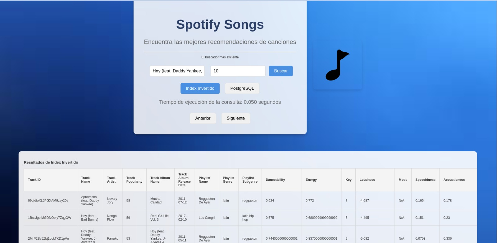

# Proyecto: Búsqueda y Recuperación de la Información

### Descripción
Este proyecto es una aplicación web que permite realizar búsquedas avanzadas en una base de datos de canciones de Spotify, mostrando información relevante como ID, nombre, artista, popularidad y álbum. Combina un backend en Python con Flask y PostgreSQL con un frontend desarrollado en HTML, CSS y JavaScript.

---

## Características principales
- Búsqueda optimizada utilizando índice invertido
- Visualización de resultados con campos clave:
  - `Track ID`
  - `Track Name`
  - `Track Artist`
  - `Track Popularity`
  - `Track Album Name`
- Selección dinámica entre dos tablas con diferentes estructuras (`Indice invertido` y `Indice Postgresql`).
- Interfaz de usuario amigable con resultados interactivos.
- Medición y visualización del tiempo de consulta.

---

## Tecnologías utilizadas
### Backend
- **Python 3.10** 
- **Flask**: Framework para construir el servidor y manejar las rutas.
- **PostgreSQL**: Base de datos relacional para almacenar información musical.
- **psycopg2**: Librería para conectar Python con PostgreSQL.

### Frontend
- **HTML/CSS/JavaScript**: Construcción de la interfaz.
- **Fetch API**: Manejo de solicitudes HTTP para conectar el frontend con el backend.

---

## Estructura del Proyecto
```plaintext
📁 Proyecto
│
├── 📂 backend
│   ├── app.py                 # Archivo principal de Flask
│   ├── consulta_db.py         # Lógica de consultas a PostgreSQL
│   └── requirements.txt       # Dependencias del proyecto
│
├── 📂 frontend
│   ├── index.html             # Interfaz de usuario
│   ├── styles.css             # Estilos personalizados
│   └── script.js              # Lógica de interacción con el usuario
│
└── README.md                  # Documentación del proyecto
```

## Interfaz del usuario principal


## Resultados de búsqueda index invertido 



## Resultados de búsqueda index postgresql


