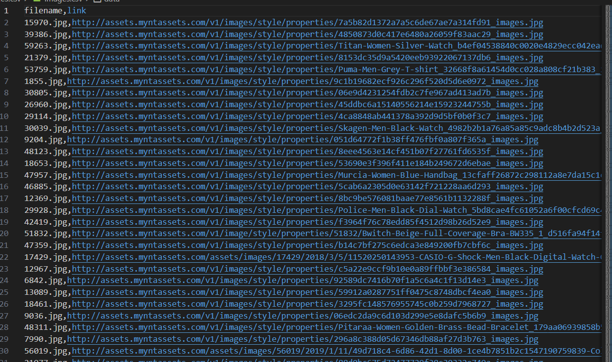
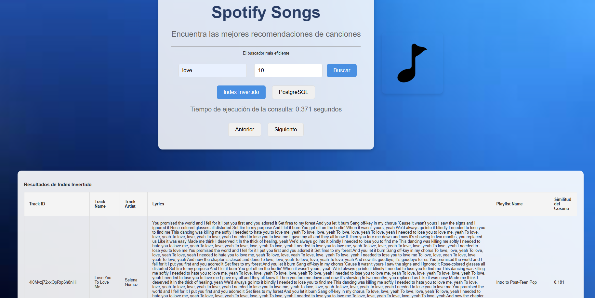
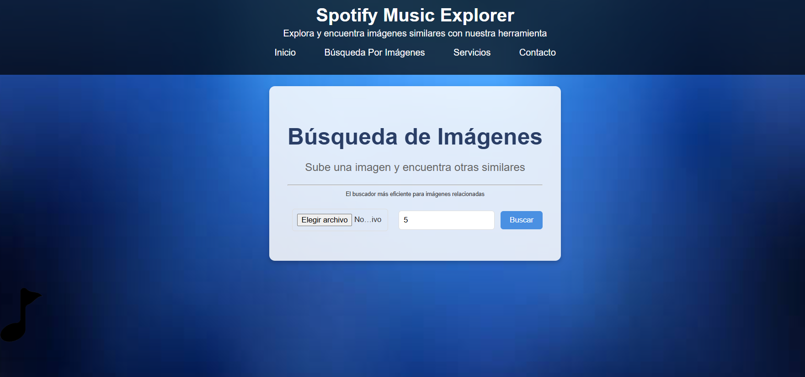
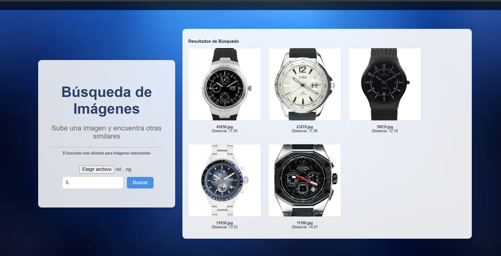
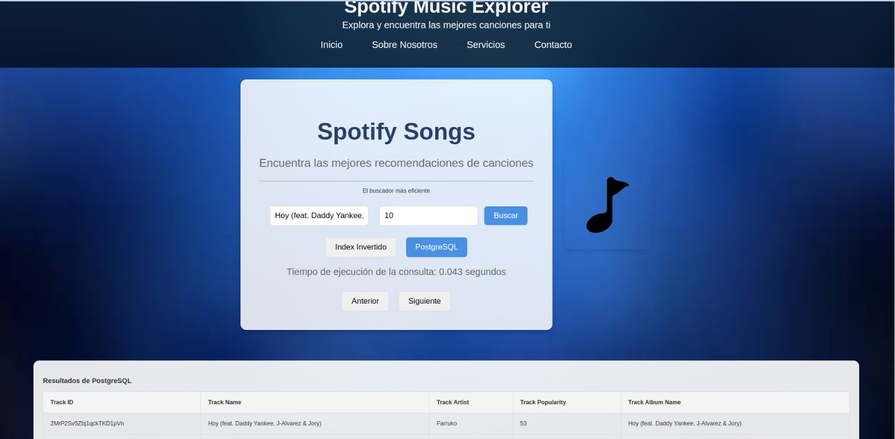

# Proyecto: Búsqueda y Recuperación de la Información

### Descripción
Este proyecto es una aplicación web que permite realizar búsquedas avanzadas en una base de datos de canciones de Spotify, mostrando información relevante como ID, nombre, artista, popularidad y álbum. Combina un backend en Python con Flask y PostgreSQL con un frontend desarrollado en HTML, CSS y JavaScript.

---

## Características principales
- Búsqueda optimizada utilizando índice invertido
- Visualización de resultados con campos clave:
  - `Track ID`
  - `Track Name`
  - `Track Artist`
  - `Track Popularity`
  - `Track Album Name`
- Selección dinámica entre dos tablas con diferentes estructuras (`Indice invertido` y `Indice Postgresql`).
- Interfaz de usuario amigable con resultados interactivos.
- Medición y visualización del tiempo de consulta.

---

## Tecnologías utilizadas
### Backend
- **Python 3.10** 
- **Flask**: Framework para construir el servidor y manejar las rutas.
- **PostgreSQL**: Base de datos relacional para almacenar información musical.
- **psycopg2**: Librería para conectar Python con PostgreSQL.

### Frontend
- **HTML/CSS/JavaScript**: Construcción de la interfaz.
- **Fetch API**: Manejo de solicitudes HTTP para conectar el frontend con el backend.

---

## Estructura del Proyecto
```plaintext
📁 Proyecto
│
├── 📂 backend
│   ├── app.py                 # Archivo principal de Flask
│   ├── consulta_db.py         # Lógica de consultas a PostgreSQL
│   └── requirements.txt       # Dependencias del proyecto
│
├── 📂 frontend
│   ├── index.html             # Interfaz de usuario
│   ├── styles.css             # Estilos personalizados
│   └── script.js              # Lógica de interacción con el usuario
│
└── README.md                  # Documentación del proyecto
```

# Organización del equipo

| Participante      | Papel |
|-------------------|-------|
| Aldair Seminario | Creación de índice invertido, Implementación de SPIMI para busqueda textual y diseño de frontend|
| Nicol Campoverde | Adaptación del frontend con el backend y implementación de busqueda por imágenes                |
| OMAR             | Procesamiento de archivos csv y además  del desarrollo de la base de datos en postgres          |


# Tabla de contenidos
## Introducción
- [Datos](#Datos)
- [Librerías utilizadas](#librerías-utilizadas)
- [Técnicas de indexación (usando indice invertido)](#técnica-de-indexación-de-las-librerías-utilizadas---índice-multimedia)
- [Ténica Multimedia (usando Knn)](#como-se-realiza-el-knn-search-y-el-range-search)

## Backend
- [Construcción del índice invertido](#construcción-del-índice-invertido)
- [Construcción del indice Multimedia](#manejo-de-memoria-secundaria)
- [Manejo de memoria secundaria](#ejecución-óptima-de-consultas)

## Análisis de Tamaño de Buffert
- [Análisis sobre los Bufferts ](#análisis-de-la-maldición-de-la-dimensionalidad-y-cómo-mitigarlo)

## Frontend
- [Diseño del índice con PostgreSQL](#diseño-del-índice-con-postgresql)
- [Análisis comparativo con su propia implementación](#análisis-comparativo-con-su-propia-implementación)
- [Screenshots de la GUI](#screenshots-de-la-gui)

## Experimentación
- [Resultados de la query](#resultados-de-la-query)
- [Análisis y discusión](#análisis-y-discusión)

<!-- Secciones -->
## 1) Datos

### 1.1) Búsquedas textuales:
El dataset Spotify Songs es un archivo CSV que contiene información sobre diversas canciones.
Este archivo incluye detalles como el álbum al que pertenece cada canción, la letra, y 
otros atributos relevantes que se utilizarán para trabajar en el proyecto. Es importante tener en 
cuenta que el archivo contiene un total de 18,456 registros.



### 1.2) Búsquedas por imágenes:

En cuanto a las búsquedas por imágenes, debido a la falta de un dataset completo que 
contenga tanto imágenes como descripciones, decidimos trabajar con un dataset separado.
Este dataset contiene 44,000 fotos de productos comunes que se encuentran en una tienda.
Estas imágenes serán utilizadas en el proyecto para realizar las búsquedas visuales.

{: width="100px" }


## Librerías utilizadas
[Contenido de la sección aquí]

## Técnica de indexación de las librerías utilizadas - Índice multimedia
[Contenido de la sección aquí]

## Como se realiza el KNN Search y el Range Search
[Contenido de la sección aquí]

## Construcción del índice invertido
[Contenido de la sección aquí]

## Manejo de memoria secundaria
[Contenido de la sección aquí]

## Ejecución óptima de consultas
[Contenido de la sección aquí]

## Análisis de la maldición de la dimensionalidad y cómo mitigarlo
[Contenido de la sección aquí]

## Diseño del índice con PostgreSQL
[Contenido de la sección aquí]

## Análisis comparativo con su propia implementación
[Contenido de la sección aquí]

## Screenshots de la GUI
[Contenido de la sección aquí]

## Resultados de la query
[Contenido de la sección aquí]

## Análisis y discusión
[Contenido de la sección aquí]


## Interfaz del usuario principal


## Resultados de búsqueda index invertido 



## Interfaz del usuario principal para Busqueda de imágenes



## Resultados de búsqueda  de imágenes 



## IMPLEMENTACIÓN DEL INDICE INVERTIDO PARA LA BUSQUEDA TEXTUAL 
Clase
## Resultados de búsqueda index postgresql


